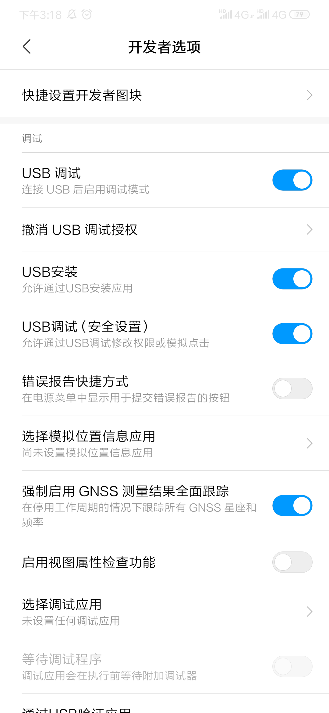

## 使用方法
1.使用数据线连接到电脑  
2.打开 USB 调试和 USB 模拟点击  
3.打开对应的任务页面  
4.运行 py 程序（<strong>只适配了小米9</strong>）  

  
    

### 2019 天猫双11活动：全民开喵喵
对应文件：[Tmall1111.py](https://github.com/hncboy/HolidayShoppingActivity/blob/master/Tmall1111.py)  
天猫的任务页面每次重新进入会发生变化，所有任务条目不确定，该程序执行有 bug。

  
    

### 2019 京东双11活动：全民养红包
对应文件：[JD1111.py](https://github.com/hncboy/HolidayShoppingActivity/blob/master/JD1111.py)  
该程序执行顺利

  
    

